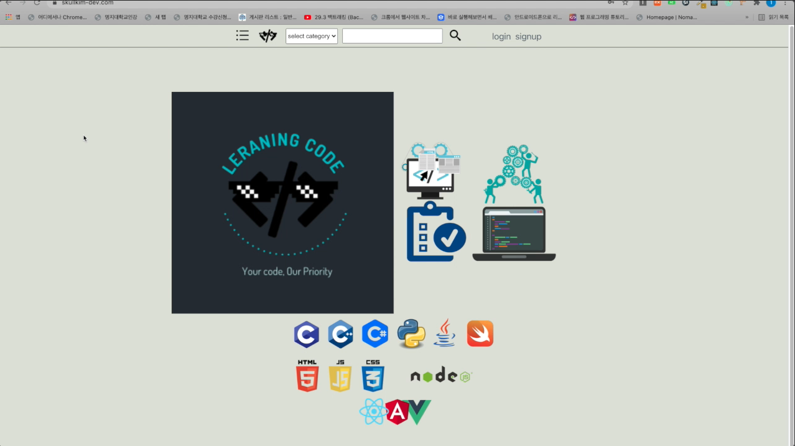

## Reactoring 2021 spring semester Team project2 refactoring
- - -
## Project name
  Learning Code
  - - -
## Description
  A website to share programming knowledge
  - - -
## Goal
  I made this project to learn react, API server, docker, nginx, HTTPS
  - - -
## Used skills 
  Front-end: React  
  Backend: express  
  Database: mysql  
  Infra: nginx, docker
- - -
## Demonstration video

## Project before refactoring
  [repository](https://github.com/skullkim/teamProject2)
- - -
## License
  This project is licensed under the terms of the MIT license
